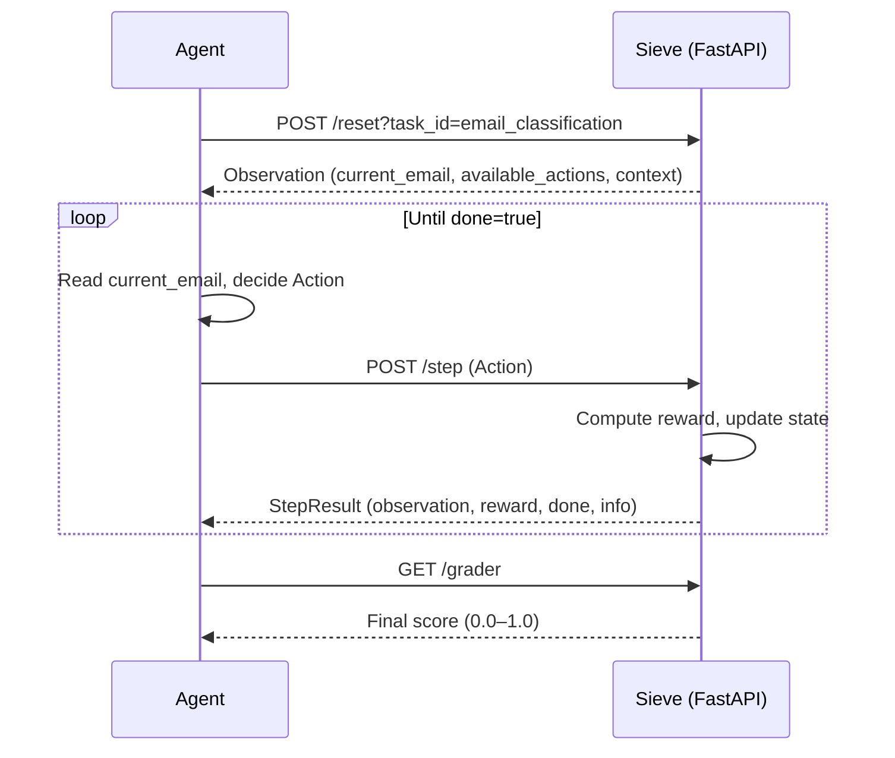

# Sieve — Customer Support RL Environment

Sieve is a reinforcement learning environment that simulates a real-world customer support inbox. An AI agent interacts with it through a standard `reset() / step() / state()` HTTP API, receiving emails, taking actions, and earning rewards based on how well it handles each situation.

## How It Works




```
Agent                          Sieve (FastAPI server)
  |                                      |
  |-- POST /reset?task_id=<id> --------> |  Loads email queue, returns first Observation
  |<- Observation ---------------------- |
  |                                      |
  |-- POST /step  (Action) -----------> |  Processes action, computes reward
  |<- { observation, reward, done, info} |
  |                                      |
  |   ... repeat until done=true ...     |
  |                                      |
  |-- GET /grader ---------------------->|  Returns final grader score (0.0–1.0)
```

Each episode follows this loop:
- The agent calls `/reset` with a `task_id` to start a fresh episode and receive the initial `Observation`
- The agent reads the current email(s) from the observation and decides on an `Action`
- The agent posts the action to `/step` and receives the next `Observation`, a `Reward`, and a `done` flag
- When `done=true`, the agent calls `/grader` to get the final episode score

The reward at each step reflects immediate quality (correct classification, good response, right prioritization). A small step penalty of `-0.005` is applied every step to discourage unnecessary actions. The final grader score is a separate holistic metric computed over the full episode.

## Project Structure

```
.
├── models.py          # Shared Pydantic models (Action, Observation, Reward, etc.)
├── inference.py       # Baseline agent script using OpenAI client
├── logger.py          # Structured [START]/[STEP]/[END] stdout logger
├── openenv.yaml       # OpenEnv environment metadata
├── pyproject.toml     # Project config and dependencies
├── Dockerfile         # Container definition
└── server/
    ├── app.py         # FastAPI application and API endpoints
    ├── environment.py # Core environment logic (step, reset, reward, grader)
    ├── data.py        # Email datasets for all three tasks
    └── config.py      # Action schema definition
```

## Tasks

### Task 1 — Email Classification (Easy)

The agent receives one email at a time and must classify it using the `classify` action.

**Available action:** `classify` only

**Step Rewards**
- Correct category: `+0.15`
- Wrong category: `-0.05`
- Correct urgency: `+0.05`
- Wrong urgency: `-0.02`
- Wrong action type: `-0.05`
- Step penalty: `-0.005`

**Final Grader Score**
- Category accuracy: `70%` weight
- Urgency accuracy: `30%` weight

---

### Task 2 — Response Drafting (Medium)

The agent reads a customer email and drafts a professional response using the `respond` action.

**Available action:** `respond` only

**Step Rewards**
- Response >= 50 characters: `+0.05`
- Response < 50 characters: `-0.10`
- Keyword coverage: up to `+0.25` (scaled by `matched / min_required`)
- Negative/unprofessional tone (VADER neg > 0.4): `-0.10`
- Wrong action type: `-0.05`
- Step penalty: `-0.005`

**Final Grader Score**
- Keyword coverage weighted at `0.80`
- Length bonus up to `0.20` (scaled by `length / 200`, requires length > 50)
- Averaged across all emails in the task

---

### Task 3 — Full Support Session (Hard)

The agent manages a queue of 15 mixed emails. It must choose which email to handle, classify it, and take the right action — all in the correct priority order.

**Available actions:** `respond`, `escalate`, `archive`, `skip`

**Priority rules**
- VIP customers (`sender_tier=vip`) must be handled before standard customers
- High urgency emails take precedence over medium and low
- Security breaches and VIP incidents → `escalate`
- Spam and feature requests → `archive`
- Standard billing and technical issues → `respond`
- Use `email_id` in the action to select which email to process

**Step Rewards**
- VIP email handled in first 4 positions: `+0.08`
- VIP email delayed (position >= 4): `-0.05`
- High urgency email in first 6 positions: `+0.05`
- Low urgency email after position 6: `+0.03`
- Correct category: `+0.04`
- Correct urgency: `+0.02`
- Correct action: `+0.06`
- Wrong action: `-0.03`
- Response text provided and > 50 characters: `+0.02`
- Spam not archived: `-0.04`
- Step penalty: `-0.005`

**Final Grader Score**
- VIP prioritization: up to `0.20` (40% credit if handled late)
- High urgency prioritization: up to `0.10` (40% credit if handled late)
- Category accuracy: up to `0.15`
- Urgency accuracy: up to `0.15`
- Action accuracy: up to `0.30`
- Email coverage: up to `0.10`
- Maximum: `1.0`

---

## Data Models

### Enums

#### ActionType
- `classify` — Classify an email into a category and urgency
- `respond` — Draft a response to an email
- `escalate` — Escalate an email with a reason
- `archive` — Archive an email
- `skip` — Skip the current email

#### Category
- `billing` — Payment, invoices, subscription issues
- `technical` — Bugs, errors, technical failures
- `general` — General inquiries
- `spam` — Unsolicited or irrelevant messages
- `account` — Account access, settings, profile issues
- `feature_request` — Requests for new features

#### Urgency
- `high` — Requires immediate attention
- `medium` — Standard priority
- `low` — Can be handled later

### Models

#### Email
- `id` (`str`) — Unique email identifier
- `subject` (`str`) — Email subject line
- `body` (`str`) — Email body content
- `sender` (`str`) — Sender's email address
- `sender_tier` (`str`, default: `"standard"`) — Customer tier (`standard` or `vip`)
- `received_minutes_ago` (`int`, default: `0`) — How long ago the email was received

#### Action
- `action_type` (`ActionType`) — The action to perform
- `category` (`Category`, optional) — Email category, used with `classify`
- `urgency` (`Urgency`, optional) — Email urgency, used with `classify`
- `response_text` (`str`, optional) — Drafted response, used with `respond`
- `escalation_reason` (`str`, optional) — Reason for escalation, used with `escalate`
- `email_id` (`str`, optional) — Target email ID, used in `support_session` to select which email to process

#### Observation
- `current_email` (`Email`, optional) — The email currently being processed
- `email_queue` (`List[Email]`, default: `[]`) — Queue of pending emails, populated in Task 3 only
- `processed_count` (`int`, default: `0`) — Number of emails processed so far
- `step_count` (`int`, default: `0`) — Current step number
- `task_id` (`str`) — Active task identifier
- `task_description` (`str`) — Human-readable task description
- `available_actions` (`List[str]`) — Actions valid for the current state
- `context` (`Dict`) — Additional context such as `max_steps`, `remaining_steps`, `queue_size`

#### Reward
- `value` (`float`) — Total reward for the step
- `components` (`Dict[str, float]`, default: `{}`) — Breakdown of reward sub-components
- `reason` (`str`, default: `""`) — Human-readable explanation of the reward

#### StepResult
- `observation` (`Observation`) — Next environment observation
- `reward` (`Reward`) — Reward received for the action
- `done` (`bool`) — Whether the episode has ended
- `info` (`Dict`) — Additional diagnostic information

## Observation Space

```json
{
  "current_email": {
    "id": "string",
    "subject": "string",
    "body": "string",
    "sender": "string",
    "sender_tier": "standard | vip",
    "received_minutes_ago": "integer"
  },
  "email_queue": "array of Email (populated in support_session only)",
  "processed_count": "integer",
  "step_count": "integer",
  "task_id": "string",
  "task_description": "string",
  "available_actions": ["classify", "respond", "escalate", "archive", "skip"],
  "context": {
    "max_steps": "integer",
    "remaining_steps": "integer",
    "queue_size": "integer"
  }
}
```

## Action Space

```json
{
  "action_type": "classify | respond | escalate | archive | skip",
  "category": "billing | technical | general | spam | account | feature_request",
  "urgency": "high | medium | low",
  "response_text": "string (for respond action)",
  "escalation_reason": "string (for escalate action)",
  "email_id": "string (for support_session — selects which email to process)"
}
```

## Backend API

| Method | Path | Description |
|--------|------|-------------|
| `POST` | `/reset?task_id=<id>` | Reset environment for a task, returns initial Observation |
| `POST` | `/step` | Submit an Action, returns `{observation, reward, done, info}` |
| `GET` | `/state` | Current environment state |
| `GET` | `/tasks` | List all tasks with action schema |
| `GET` | `/grader` | Current grader score (0.0–1.0) |

## Setup

**Prerequisites:** Python 3.11+, [uv](https://github.com/astral-sh/uv)

**Install dependencies**
- `uv sync`

**Environment variables**

- `API_BASE_URL` — LLM API endpoint (default: `https://router.huggingface.co/v1`)
- `MODEL_NAME` — Model identifier (default: `Qwen/Qwen2.5-7B-Instruct`)
- `OPENAI_API_KEY` — API key for the LLM provider
- `HF_TOKEN` — Hugging Face token
- `ENV_BASE_URL` — Running environment URL (default: `http://localhost:7860`)

**Run the server**
- `uvicorn server.app:app --host 0.0.0.0 --port 7860`

**Run baseline inference**
- `python inference.py`

**Run with Docker**
- `docker build -t sieve .`
- `docker run -p 7860:7860 -e OPENAI_API_KEY=... sieve`

## Baseline Scores

Baseline agent: `gpt-4o-mini` via OpenAI API

| Task | Score | Steps | Total Reward |
|------|-------|-------|--------------|
| Email Classification | 0.930 | 10 | 1.755 |
| Response Drafting | 0.956 | 6 | 1.692 |
| Support Session | 0.870 | 15 | 1.490 |
| **Average** | **0.919** | — | — |
